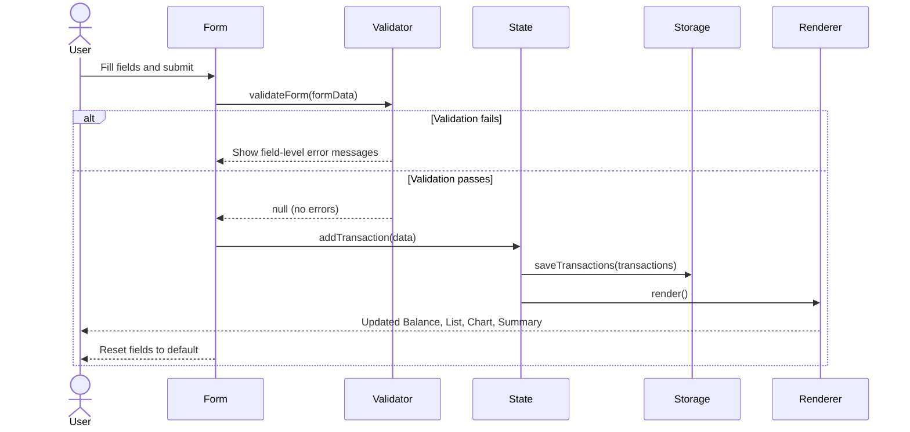
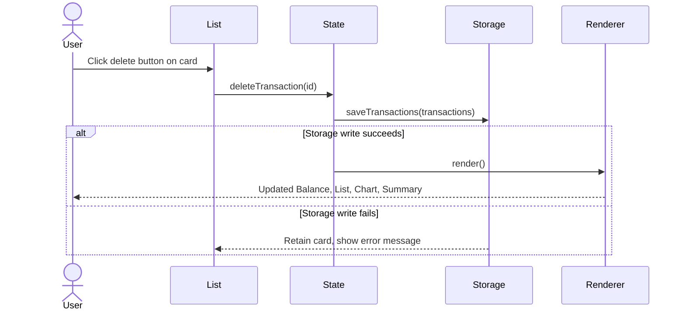

# Design Document: Expense & Budget Visualizer

## Overview

The Expense & Budget Visualizer is a fully client-side single-page application (SPA) built with plain HTML, CSS, and Vanilla JavaScript. It enables users to record personal expense transactions, visualize spending by category via a pie chart, review monthly summaries, and toggle between USD and IDR currencies. All data is persisted in the browser's `localStorage` — no server, no build tools, no frameworks.

The application is delivered as three files:
- `index.html` — markup and CDN script tags
- `css/style.css` — all styling, responsive layout, and theme tokens
- `js/script.js` — all application logic, state management, rendering, and storage

Chart.js 4.x is loaded from CDN and is the only external dependency.

### Design Goals

- **Zero-dependency runtime**: works by opening `index.html` directly in a browser.
- **Single source of truth**: `localStorage` holds all transactions and the active currency preference.
- **Render-on-change**: every mutation (add/delete/currency toggle) triggers a full re-render of all affected UI regions within the specified timing budgets.
- **Shared currency formatter**: one function handles all monetary display so adding a new currency requires a single-location change.

---

## Architecture

The application follows a simple **unidirectional data flow** pattern:

```
User Action
    │
    ▼
Event Handler (in script.js)
    │
    ├─► Mutate State (in-memory array + localStorage)
    │
    └─► render() ──► DOM update (Balance, List, Chart, Summary)
```

All application state lives in a single in-memory object that is kept in sync with `localStorage`. Every user action calls a mutation function, which updates both the in-memory state and `localStorage`, then calls the top-level `render()` function to repaint all UI regions.

### Module Boundaries (within script.js)

Although the project is a single file, the code is organized into logical sections:

| Section | Responsibility |
|---|---|
| **State** | In-memory `appState` object (transactions array, activeCurrency) |
| **Storage** | `loadState()`, `saveTransactions()`, `saveCurrency()` — all localStorage I/O |
| **Validation** | `validateForm(formData)` — returns errors or null |
| **Formatters** | `formatCurrency(amount, currency)` — single shared render function |
| **Mutations** | `addTransaction(data)`, `deleteTransaction(id)` |
| **Renderers** | `renderBalance()`, `renderList()`, `renderChart()`, `renderSummary()`, `renderMonthSelector()` |
| **Top-level render** | `render()` — calls all renderers in sequence |
| **Event Listeners** | Form submit, delete button delegation, currency toggle, month selector |

### Sequence: Adding a Transaction



### Sequence: Deleting a Transaction



---

## Components and Interfaces

### 1. Input Form (`#expense-form`)

**Markup**: A `<form>` element with three inputs and a submit button.

| Field | Type | Constraints |
|---|---|---|
| Item Name (`#item-name`) | `<input type="text">` | Required, max 100 chars |
| Amount (`#amount`) | `<input type="number">` | Required, > 0, ≤ 2 decimal places |
| Category (`#category`) | `<select>` | Required, options: Food / Transport / Fun |

**Validation logic** (runs on submit, before any state mutation):
- Item Name: empty → error; length > 100 → error
- Amount: empty, ≤ 0, non-numeric, or > 2 decimal places → error
- Category: no selection → error

Errors are displayed as inline `<span class="error-msg">` elements beneath each field. All errors are cleared on the next submit attempt.

**Post-submit reset**: on success, all three fields are reset to their default/placeholder state.

### 2. Transaction List (`#transaction-list`)

Rendered by `renderList()`. Each transaction is a `<div class="transaction-card">` containing:
- Item name
- Amount formatted via `formatCurrency()`
- Category badge (`<span class="badge badge--{category}">`)
- Delete button (`<button data-id="{id}">`)

The list is rendered in reverse chronological order (newest first). A single delegated `click` listener on the list container handles all delete button clicks.

If no transactions exist, a placeholder `<p class="empty-msg">` is shown instead.

**Category badge colors** (CSS classes):
- `badge--food`: pastel green (`#A8D5A2`)
- `badge--transport`: pastel orange (`#FFB347`)
- `badge--fun`: light beige (`#F5E6C8`)

### 3. Balance Card (`#balance-card`)

Rendered by `renderBalance()`. Displays the sum of all transaction amounts formatted via `formatCurrency()`. Styled with a pastel green background. Updates within 500ms of any add/delete.

### 4. Pie Chart (`#spending-chart`)

Rendered by `renderChart()` using Chart.js 4.x (CDN). 

- Aggregates transaction amounts by category.
- Segment colors: Food → `#A8D5A2`, Transport → `#FFB347`, Fun → `#F5E6C8`.
- Legend labels include category name and total formatted via `formatCurrency()`.
- Categories with zero total are excluded from the chart.
- If no transactions exist, the canvas is hidden and a placeholder message is shown.
- The Chart.js instance is stored in a module-level variable; on each re-render, `chart.data` is updated and `chart.update()` is called (rather than destroying and recreating the instance) to avoid flicker.

### 5. Monthly Summary (`#monthly-summary`)

Rendered by `renderSummary()` and `renderMonthSelector()`.

**Month selector dropdown** (`#month-selector`):
- Lists all months for which at least one transaction exists, plus the current calendar month.
- Format: `"Month YYYY"` (e.g., `"May 2026"`).
- No duplicate entries; sorted chronologically.
- Changing the selection triggers `renderSummary()`.

**Summary statistics** (for the selected month):
- Total expenses (sum of amounts, formatted to 2 decimal places in active currency)
- Transaction count
- Highest spending category (alphabetical tiebreak)
- Average transaction amount (rounded to 2 decimal places)

If no transactions exist for the selected month, all statistics show zero values and a "no data" message is displayed.

**Responsive layout**: single column below 600px viewport width, multi-column at 600px and above (CSS Grid or Flexbox with `flex-wrap`).

### 6. Currency Converter Toggle (`#currency-toggle`)

A `<button>` or `<input type="checkbox">` toggle that switches `appState.activeCurrency` between `"USD"` and `"IDR"`.

- Default on first load (no persisted preference): `"USD"`.
- On toggle: updates `appState.activeCurrency`, persists to `localStorage`, calls `render()`.
- All monetary values update within 300ms.
- IDR values are computed at render time only: `usdAmount * 16000`. No IDR values are written to `localStorage`.

### 7. Shared Currency Formatter (`formatCurrency`)

```js
/**
 * Formats a numeric USD amount for display in the active currency.
 * This is the single location that must be changed to add a new currency.
 *
 * @param {number} usdAmount - The amount stored in USD
 * @param {string} currency  - "USD" or "IDR"
 * @returns {string}         - Formatted string, e.g. "$1,250.50" or "Rp 1.250.000"
 */
function formatCurrency(usdAmount, currency) {
  if (currency === "IDR") {
    const idrAmount = usdAmount * 16000;
    return new Intl.NumberFormat("id-ID", {
      style: "currency",
      currency: "IDR",
      minimumFractionDigits: 0,
      maximumFractionDigits: 0,
    }).format(idrAmount);
  }
  return new Intl.NumberFormat("en-US", {
    style: "currency",
    currency: "USD",
    minimumFractionDigits: 2,
    maximumFractionDigits: 2,
  }).format(usdAmount);
}
```

All renderers call this function. No renderer performs its own currency arithmetic.

---

## Data Models

### Transaction Object

All transactions are stored as an array of plain objects in `localStorage` under the key `"transactions"`.

```js
/**
 * @typedef {Object} Transaction
 * @property {string} id         - UUID v4 generated at creation time (crypto.randomUUID())
 * @property {string} itemName   - User-provided item name (1–100 characters)
 * @property {number} amount     - Positive numeric value in USD, up to 2 decimal places
 * @property {string} category   - One of: "Food" | "Transport" | "Fun"
 * @property {string} createdAt  - ISO 8601 timestamp string (new Date().toISOString())
 */
```

**Example stored value:**
```json
[
  {
    "id": "a1b2c3d4-e5f6-7890-abcd-ef1234567890",
    "itemName": "Lunch at Warung",
    "amount": 5.50,
    "category": "Food",
    "createdAt": "2026-05-11T10:30:00.000Z"
  }
]
```

### App State Object (in-memory)

```js
/**
 * @typedef {Object} AppState
 * @property {Transaction[]} transactions  - All loaded transactions
 * @property {string}        activeCurrency - "USD" | "IDR"
 */
const appState = {
  transactions: [],
  activeCurrency: "USD",
};
```

### localStorage Keys

| Key | Type | Description |
|---|---|---|
| `"transactions"` | JSON string (array) | All transaction objects |
| `"activeCurrency"` | `"USD"` or `"IDR"` | User's currency preference |

### Validation Rules (enforced before storage)

| Field | Rule | Error Message |
|---|---|---|
| `itemName` | Non-empty, ≤ 100 chars | "Item name is required" / "Item name must be 100 characters or fewer" |
| `amount` | Numeric, > 0, ≤ 2 decimal places | "Amount must be a positive number with at most 2 decimal places" |
| `category` | One of Food/Transport/Fun | "Please select a category" |

### Month Selector Data Model

The month selector is derived at render time from `appState.transactions`:

```js
/**
 * Returns a sorted, deduplicated array of month strings for the selector.
 * Always includes the current calendar month.
 *
 * @param {Transaction[]} transactions
 * @returns {string[]} - e.g. ["January 2026", "May 2026"]
 */
function getAvailableMonths(transactions) { ... }
```

Months are formatted using `Intl.DateTimeFormat` with `{ month: "long", year: "numeric" }` and the `"en-US"` locale.

---

## Correctness Properties

*A property is a characteristic or behavior that should hold true across all valid executions of a system — essentially, a formal statement about what the system should do. Properties serve as the bridge between human-readable specifications and machine-verifiable correctness guarantees.*

### Property 1: Transaction persistence round-trip

*For any* valid transaction object (with a non-empty item name ≤ 100 chars, a positive amount ≤ 2 decimal places, and a valid category), serializing the transactions array to JSON and deserializing it back SHALL produce an array containing an equivalent transaction with identical `id`, `itemName`, `amount`, `category`, and `createdAt` values.

**Validates: Requirements 1.2, 7.1, 7.4**

---

### Property 2: Balance equals sum of all transaction amounts

*For any* list of transactions (including after additions and deletions), the value computed by `calculateBalance(transactions)` SHALL equal the arithmetic sum of all `amount` fields in the transactions array.

**Validates: Requirements 1.3, 2.5, 3.2, 3.3**

---

### Property 3: Whitespace-only and empty item names are rejected

*For any* string composed entirely of whitespace characters (including the empty string), submitting it as the Item Name SHALL be rejected by `validateForm()`, and the transactions array SHALL remain unchanged.

**Validates: Requirements 1.5**

---

### Property 4: Invalid amounts are rejected

*For any* amount value that is zero, negative, non-numeric, or has more than 2 decimal places, submitting it SHALL be rejected by `validateForm()`, and the transactions array SHALL remain unchanged.

**Validates: Requirements 1.6**

---

### Property 5: Currency conversion is render-only — USD stored, IDR computed

*For any* transaction added to the app, the stored `amount` field in `localStorage` SHALL always be the original numeric USD value; the IDR display value computed at render time SHALL equal `storedAmount * 16000`, and no IDR-converted value SHALL appear in the stored JSON.

**Validates: Requirements 6.2, 6.6**

---

### Property 6: formatCurrency is the single conversion point

*For any* monetary amount and active currency, the string produced by `formatCurrency(usdAmount, activeCurrency)` SHALL match the expected locale format — `$X,XXX.XX` (en-US) for USD and `Rp X.XXX` (id-ID) for IDR — and every monetary value displayed anywhere in the UI SHALL be produced exclusively by this function.

**Validates: Requirements 3.4, 6.3, 6.4, 9.3**

---

### Property 7: Delete removes transaction from both in-memory state and storage

*For any* transaction in the transactions array, after calling `deleteTransaction(id)`, the transaction with that `id` SHALL no longer appear in `appState.transactions`, and the JSON parsed from `localStorage["transactions"]` SHALL also not contain an entry with that `id`.

**Validates: Requirements 2.4, 7.2**

---

### Property 8: Monthly summary statistics are consistent with filtered transactions

*For any* selected month and any transactions array, the computed total expenses, transaction count, and average amount SHALL satisfy: `total = sum(amounts for that month)`, `count = number of transactions for that month`, `average = total / count` rounded to 2 decimal places. The highest spending category SHALL be the one with the greatest total, with alphabetical ordering as the tiebreak.

**Validates: Requirements 5.2, 5.3**

---

### Property 9: Chart segments correspond exactly to categories with positive totals

*For any* state of the transactions array, the pie chart SHALL contain a segment for a category if and only if the sum of `amount` values for that category is strictly greater than zero.

**Validates: Requirements 4.1, 4.3, 4.6**

---

### Property 10: Month selector contains no duplicates and always includes the current month

*For any* transactions array, the array returned by `getAvailableMonths()` SHALL contain no duplicate month strings, and SHALL always include the current calendar month regardless of whether any transactions exist for it.

**Validates: Requirements 5.1**

---

### Property 11: Form fields reset to default state after every successful submission

*For any* valid form submission that results in a transaction being added, the Item Name field SHALL be empty, the Amount field SHALL be empty, and the Category dropdown SHALL be reset to its default placeholder state immediately after the submission is processed.

**Validates: Requirements 1.4**

---

### Property 12: Transaction list is always rendered in reverse chronological order

*For any* non-empty transactions array, the rendered Transaction_List SHALL display cards in descending order of `createdAt` timestamp — the most recently added transaction SHALL appear first.

**Validates: Requirements 2.1**

---

### Property 13: Category badge CSS class matches the transaction's category

*For any* transaction rendered in the Transaction_List, the category badge element SHALL have the CSS class corresponding to its category: `badge--food` for Food, `badge--transport` for Transport, and `badge--fun` for Fun.

**Validates: Requirements 2.8**

---

### Property 14: Active currency preference persists across simulated page reloads

*For any* active currency value (`"USD"` or `"IDR"`), after persisting it to `localStorage` via `saveCurrency()` and then calling `loadState()`, the restored `appState.activeCurrency` SHALL equal the value that was saved.

**Validates: Requirements 6.5, 7.5, 7.6**

---

### Property 15: Malformed localStorage entries are skipped; valid entries are always loaded

*For any* array stored in `localStorage["transactions"]` that contains a mix of valid transaction objects and malformed entries (missing required fields, wrong types, or non-object values), calling `loadState()` SHALL load all valid entries into `appState.transactions` and SHALL skip all malformed entries without throwing an error.

**Validates: Requirements 7.8**

---

## Error Handling

### localStorage Unavailability

`localStorage` access can throw in private browsing modes or when storage quota is exceeded. All storage operations are wrapped in `try/catch`:

- **On load failure** (`loadState`): initialize `appState` with empty transactions and `"USD"` currency; no error shown to user (silent degradation per Requirement 7.7).
- **On save failure** (`saveTransactions` during add): the transaction is still added to `appState.transactions` in memory and the UI updates, but a non-blocking toast/banner error is shown: *"Could not save data. Changes may be lost on reload."*
- **On save failure** (`saveTransactions` during delete): the transaction is NOT removed from `appState.transactions`; the card remains in the list; an error message is shown to the user (Requirement 2.6).
- **On save failure** (`saveCurrency`): the currency toggle still applies for the current session; no error is shown (Requirement 6.7).

### Malformed localStorage Data

- If `localStorage["transactions"]` is not valid JSON: initialize with empty array (Requirement 7.7).
- If individual transaction entries are malformed (missing required fields, wrong types): skip that entry and continue loading valid entries (Requirement 7.8). A `console.warn` is emitted for each skipped entry.

### Validation Errors

Validation errors are displayed inline beneath each form field. They are cleared on the next submit attempt. No alert dialogs are used.

### Chart.js CDN Failure

If Chart.js fails to load from CDN, the chart canvas area displays a static fallback message: *"Chart unavailable. Please check your internet connection."* The rest of the app continues to function normally.

---

## Testing Strategy

### Overview

This feature is a client-side Vanilla JS application. The core logic (validation, formatting, state mutations, summary calculations) consists of pure or near-pure functions that are well-suited to property-based testing. UI rendering and layout are tested with example-based and snapshot approaches.

### Property-Based Testing

**Library**: [fast-check](https://github.com/dubzzz/fast-check) (JavaScript, runs in Node.js via a test runner such as Vitest or Jest).

Each property test runs a minimum of **100 iterations**.

Tag format for each test: `// Feature: expense-budget-visualizer, Property {N}: {property_text}`

| Property | Test Focus | Generator Strategy |
|---|---|---|
| P1: Persistence round-trip | `JSON.stringify` → `JSON.parse` preserves transaction fields | Generate arbitrary valid transactions (random strings ≤ 100 chars, positive floats ≤ 2dp, random category) |
| P2: Balance equals sum | `calculateBalance(transactions)` output matches `sum(amounts)` | Generate arrays of 0–50 valid transactions |
| P3: Whitespace names rejected | `validateForm({itemName: ws, ...})` returns error | Generate strings from `fc.string()` filtered to all-whitespace, plus empty string |
| P4: Invalid amounts rejected | `validateForm({amount: bad, ...})` returns error | Generate values: 0, negatives, > 2dp floats, NaN, strings |
| P5: Currency conversion render-only | Stored JSON never contains IDR values | Generate transactions, call `saveTransactions`, parse stored JSON, check `amount` field |
| P6: formatCurrency single point | All rendered strings match `formatCurrency` output | Generate amounts, compare rendered DOM text to `formatCurrency` output |
| P7: Delete removes from state and storage | After `deleteTransaction(id)`, id absent from both | Generate transactions array, pick random id, delete, verify |
| P8: Monthly summary consistency | `total`, `count`, `average` match filtered array math | Generate transactions across multiple months, pick random month |
| P9: Chart excludes zero-total categories | Chart segments ↔ categories with amount > 0 | Generate transactions with varying category distributions |
| P10: Month selector no duplicates + current month | `getAvailableMonths()` output is deduplicated and includes current month | Generate transactions with random dates |
| P11: Form resets after submission | All three fields return to default state after valid submit | Generate valid form inputs, submit, inspect field values |
| P12: List in reverse chronological order | Rendered cards are sorted newest-first by `createdAt` | Generate transactions with random timestamps, verify DOM order |
| P13: Badge class matches category | Each card's badge has the correct CSS class for its category | Generate transactions with random categories, inspect badge class |
| P14: Currency preference persisted | `loadState()` after `saveCurrency()` restores the same currency | Alternate between "USD" and "IDR", save, reload, verify |
| P15: Malformed entries skipped | Valid entries always loaded; malformed entries silently skipped | Generate arrays mixing valid and malformed objects, call `loadState()` |

### Unit / Example-Based Tests

- Form renders with correct initial state (all fields empty/default)
- Submitting a valid form adds exactly one transaction to the list
- Deleting the only transaction shows the empty-state message
- Currency toggle switches display from USD to IDR format
- Monthly summary shows "no data" message when no transactions exist for selected month
- Balance displays `$0.00` (USD) or `Rp 0` (IDR) when no transactions exist
- Chart shows placeholder when no transactions exist
- Malformed localStorage entry is skipped; valid entries still load

### Integration / Smoke Tests

- Opening `index.html` in a browser renders all five UI regions without JS errors
- Chart.js CDN loads and the canvas renders a pie chart after adding transactions
- `localStorage` is read on page load and transactions are restored correctly
- Responsive layout: no horizontal scroll at 320px viewport width

### Accessibility

- All form inputs have associated `<label>` elements
- Error messages are linked to inputs via `aria-describedby`
- Color is not the sole differentiator for category badges (text label also present)
- Interactive elements (buttons, toggle) are keyboard-focusable and have visible focus styles
